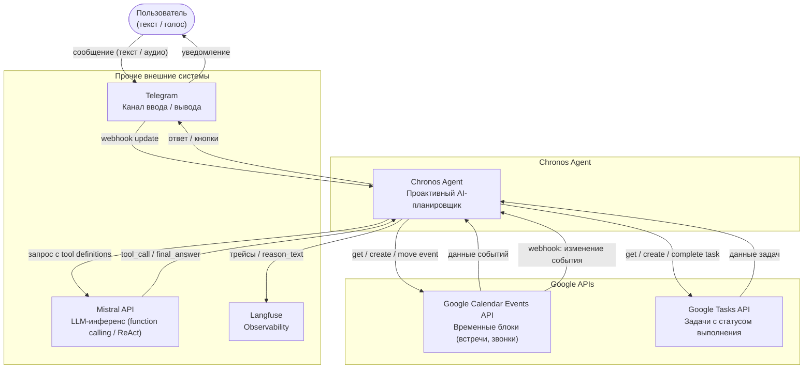

# Диаграмма 1 — C4 Context

## Цель

Показывает систему как единый «чёрный ящик» в окружении пользователей и внешних сервисов.
Ответ на вопрос: **кто взаимодействует с системой и через что?**

## Обязательные элементы

| Элемент | Тип | Описание |
|---|---|---|
| Пользователь | Person | Отправляет текстовые и голосовые сообщения |
| Chronos Agent | System | Граница системы — единый блок |
| Telegram | External | Канал ввода/вывода |
| Google Calendar Events API | External | Хранение и управление временными блоками (встречи, звонки) |
| Google Tasks API | External | Хранение задач с возможностью отметки выполнения |
| Mistral API | External | LLM-инференс |
| Langfuse | External | Observability и трассировка |

## Ключевые связи

- Пользователь ↔ Telegram ↔ Chronos Agent (запросы и ответы)
- Chronos Agent ↔ Google Calendar Events API (создание / перенос / чтение событий)
- Chronos Agent ↔ Google Tasks API (создание / выполнение / чтение задач)
- Google Calendar Events API → Chronos Agent (webhook: уведомление об изменениях)
- Google Tasks API — push-уведомления не поддерживает; задачи синхронизируются через write-through и startup recovery
- Chronos Agent ↔ Mistral API (запрос с tool definitions → tool_call / final_answer)
- Chronos Agent → Langfuse (логи трейсов, reason_text)

## Диаграмма

