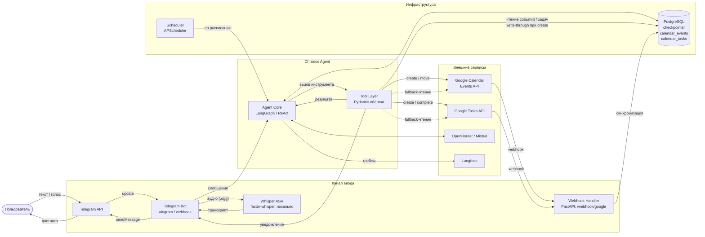

# Диаграмма 2 — C4 Container

## Цель

Раскрывает внутреннее устройство Chronos Agent: какие процессы/сервисы существуют,
как развёрнуты и как общаются между собой.

## Обязательные элементы

| Контейнер | Технология | Ответственность |
|---|---|---|
| Telegram Bot | Python / aiogram | Webhook-сервер; приём сообщений, отправка ответов и кнопок |
| Whisper ASR | Python / faster-whisper | Локальная транскрипция аудио → текст, on-demand |
| Agent Core | Python / LangGraph | ReAct-оркестратор; граф состояний; вызов инструментов |
| Tool Layer | Python / Pydantic | Обёртки: get_events, create_event, move_event, create_task, complete_task, notify_user |
| Webhook Handler | FastAPI endpoint | Приём push-уведомлений от Google; обновление локальной БД |
| Scheduler | APScheduler | Cron-триггер раз в час для проактивного flow |
| PostgreSQL | PostgreSQL 15 | LangGraph checkpointer; calendar_events; calendar_tasks; OAuth-токены |

## Ключевые связи

- Telegram Bot → Whisper (аудиофайл) → Telegram Bot (транскрипт)
- Telegram Bot → Agent Core (текст + user_id + thread_id)
- Agent Core ↔ Tool Layer (вызовы инструментов и результаты)
- Tool Layer → PostgreSQL (чтение calendar_events / calendar_tasks при get_events / get_tasks; запись write-through при create)
- Tool Layer → Google Calendar Events API (запись: create_event, move_event)
- Tool Layer → Google Tasks API (запись: create_task, complete_task)
- Tool Layer ⇢ Google Calendar Events API (fallback-чтение: только при пустом результате из БД)
- Tool Layer ⇢ Google Tasks API (fallback-чтение: только при пустом результате из БД)
- Google Calendar / Tasks API → Webhook Handler (push notification)
- Webhook Handler → PostgreSQL (обновление calendar_events / calendar_tasks)
- Agent Core ↔ OpenRouter / Mistral (запрос / structured output)
- Agent Core ↔ PostgreSQL (чтение / запись стейта через checkpointer)
- Agent Core → Langfuse (трейсы)
- Scheduler → Agent Core (cron-триггер)

## Диаграмма

