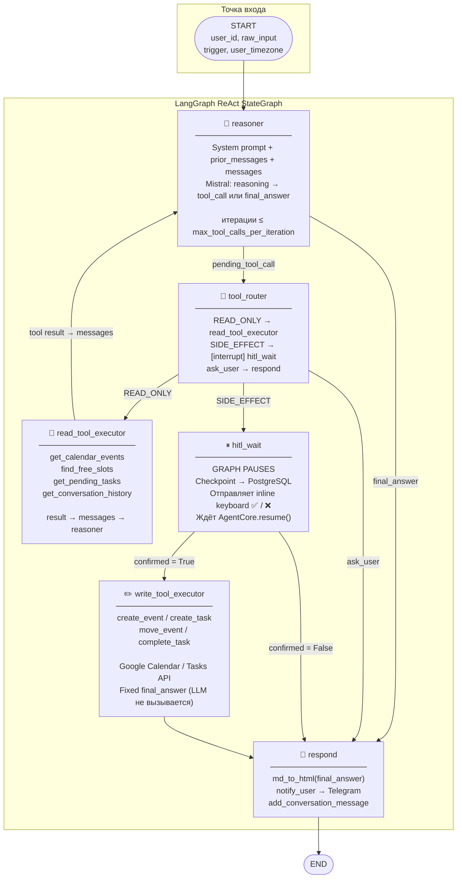

# Диаграмма 3 — C4 Component

## Цель

Раскрывает внутреннее устройство **Agent Core** (LangGraph ReAct-граф).
Показывает узлы графа, переходы между ними и точки ветвления.

## Узлы графа

| Узел | Описание |
|---|---|
| `reasoner` | LLM-вызов: system prompt + messages + REACT_TOOL_DEFINITIONS → tool_call или final_answer |
| `tool_router` | Маршрутизирует tool_call: READ_ONLY → executor, SIDE_EFFECT → HITL, TERMINAL → respond |
| `read_tool_executor` | Выполняет read-only tool (get_events, find_free_slots и др.) → добавляет tool result → reasoner |
| `hitl_wait` | Graph pauses (interrupt_before); ждёт callback кнопок ✅/❌; resume через AgentCore.resume() |
| `write_tool_executor` | После confirmed=True: выполняет side-effect tool (Google API); устанавливает fixed final_answer |
| `respond` | Конвертирует final_answer → Telegram HTML → notify_user → END |

## Ключевые связи

- `reasoner` → (tool_call) → `tool_router`
- `reasoner` → (final_answer) → `respond`
- `tool_router` → READ_ONLY tool → `read_tool_executor` → `reasoner` (loop)
- `tool_router` → SIDE_EFFECT tool → `hitl_wait` (interrupt)
- `tool_router` → `ask_user` → `respond`
- `hitl_wait` → confirmed=True → `write_tool_executor` → `respond`
- `hitl_wait` → confirmed=False → `respond`

## Диаграмма

