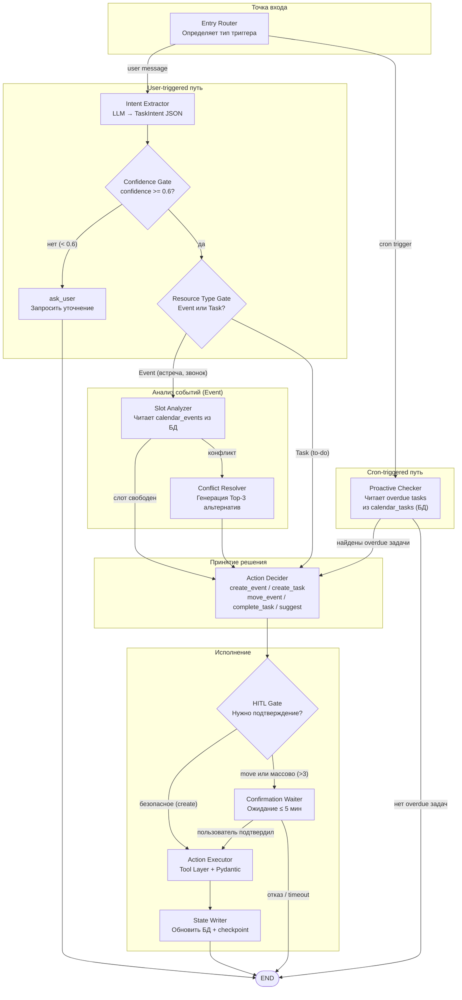

# Диаграмма 3 — C4 Component

## Цель

Раскрывает внутреннее устройство **Agent Core** (LangGraph-граф).
Показывает узлы графа, переходы между ними и точки ветвления.

## Обязательные элементы

| Компонент | Описание |
|---|---|
| Entry Router | Определяет тип триггера: user message / cron |
| Intent Extractor | LLM-вызов: текст → TaskIntent (JSON + confidence) |
| Confidence Gate | Ветвление: confidence >= 0.6 → continue, иначе → ask_user |
| Resource Type Gate | Ветвление: пользователь имеет в виду событие (Event) или задачу (Task)? |
| Slot Analyzer | Читает calendar_events из локальной БД; ищет свободные окна |
| Conflict Resolver | При конфликте — генерирует Top-3 альтернативных слота |
| Action Decider | Выбирает action: create_event / create_task / move_event / complete_task / suggest / ask_user |
| Action Executor | Вызывает Tool Layer; применяет Pydantic-валидацию |
| HITL Gate | Ветвление: нужно ли подтверждение пользователя |
| Confirmation Waiter | Ждёт ответа (≤ 5 мин); при timeout → stale |
| State Writer | Обновляет локальную БД; пишет checkpoint в PostgreSQL |
| Proactive Checker | Cron-путь: читает overdue tasks из локальной calendar_tasks |

## Ключевые связи

- Entry Router → Intent Extractor (user path) или Proactive Checker (cron path)
- Intent Extractor → Confidence Gate → Resource Type Gate
- Resource Type Gate → Slot Analyzer (для Event) или Action Decider напрямую (для Task)
- Slot Analyzer → Conflict Resolver (конфликт) или Action Decider (слот свободен)
- Conflict Resolver → Action Decider
- Action Decider → HITL Gate
- HITL Gate → Confirmation Waiter (деструктивное / move) или Action Executor (безопасное)
- Confirmation Waiter → Action Executor (OK) или END (отказ / timeout)
- Action Executor → State Writer → END

## Диаграмма

