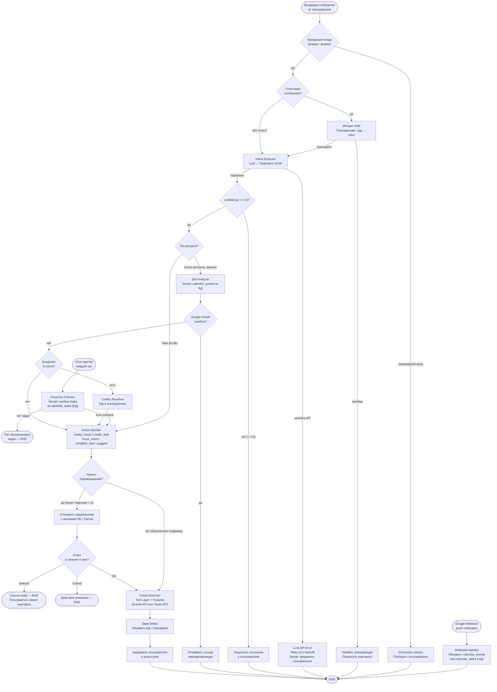

# Диаграмма 4 — Workflow / Graph Diagram

## Цель

Показывает **пошаговое выполнение запроса** от входящего сообщения до финального результата,
включая все ветки ошибок, fallback-пути и проактивный flow.

## Обязательные элементы

- Два точки входа: пользовательский запрос и cron-триггер
- Ветка транскрипции (только для голосовых сообщений)
- Ветвление по confidence (< 0.6 → уточнение)
- Ветвление по типу ресурса: Event (анализ слотов) vs Task (прямое создание)
- HITL-ветка для деструктивных и массовых действий
- Обработка timeout подтверждения
- Cron-путь: читает overdue tasks из локальной БД → предложение переноса
- Webhook-путь: входящее уведомление от Google → обновление локальной БД
- Failure-пути: LLM API error, Google OAuth error, невалидный ввод

## Диаграмма

