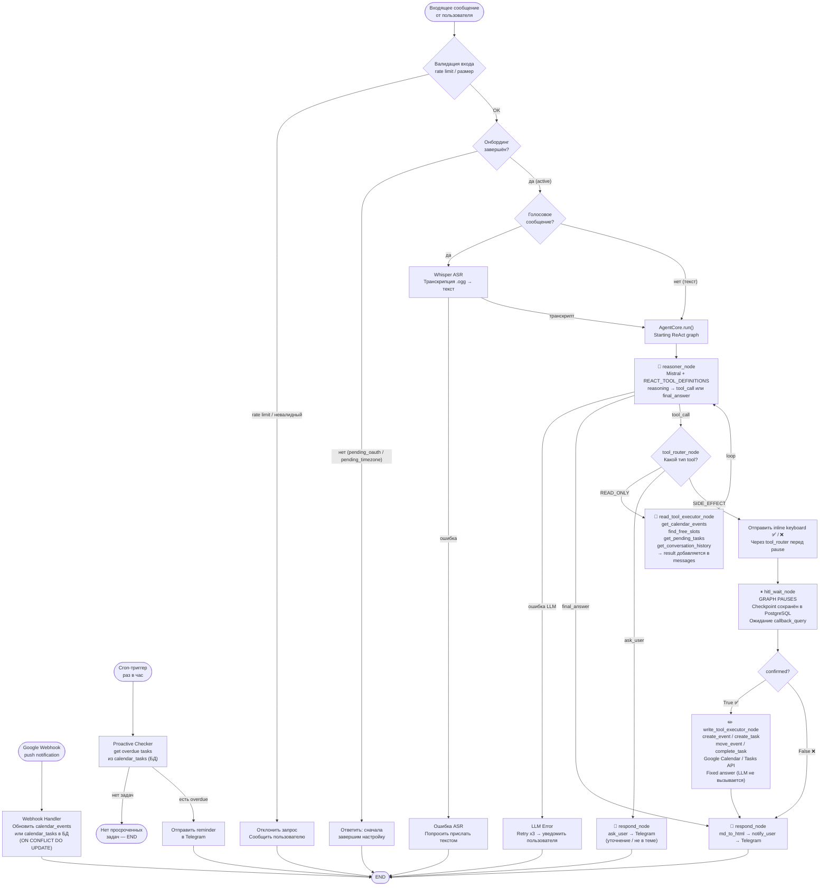

# Диаграмма 4 — Workflow / Graph Diagram

## Цель

Показывает **пошаговое выполнение запроса** от входящего сообщения до финального результата,
включая все ветки ошибок, fallback-пути и проактивный flow.

## Обязательные элементы

- Два точки входа: пользовательский запрос и cron-триггер
- Ветка транскрипции (только для голосовых сообщений)
- Предварительная фильтрация (rate limit, onboarding gate, off-topic regex)
- ReAct loop: reasoner → tool_router → [read executor | hitl_wait | respond]
- HITL-ветка для всех side-effect операций (create, move, complete)
- Проактивный cron-путь: читает overdue tasks → Telegram reminder
- Webhook-путь: входящее уведомление от Google → обновление локальной БД
- Failure-пути: LLM API error, Google OAuth error, невалидный ввод

## Диаграмма

