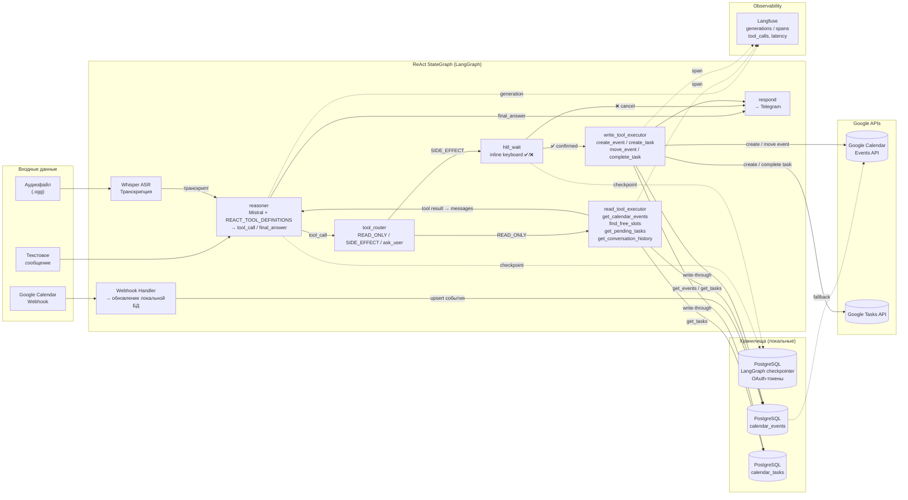

# Диаграмма 5 — Data Flow Diagram

## Цель

Показывает **как данные проходят через систему**: что является входом, как трансформируется,
что сохраняется, что логируется и какие данные возвращаются пользователю.

## Ключевые трансформации данных

| Вход | Трансформация | Выход |
|---|---|---|
| Аудиофайл (.ogg) | Whisper ASR | Текстовый транскрипт |
| Текст + prior_messages + REACT_TOOL_DEFINITIONS | Mistral (reasoner) | tool_call или final_answer |
| tool_call (READ_ONLY) | read_tool_executor | tool result → messages |
| tool_call (SIDE_EFFECT) | tool_router → HITL | inline keyboard ✅/❌ |
| confirmed=True + pending_tool_call | write_tool_executor | Запись в Google Calendar / Tasks API |
| Google push notification | Webhook Handler | Обновление calendar_events в БД |

## Диаграмма

