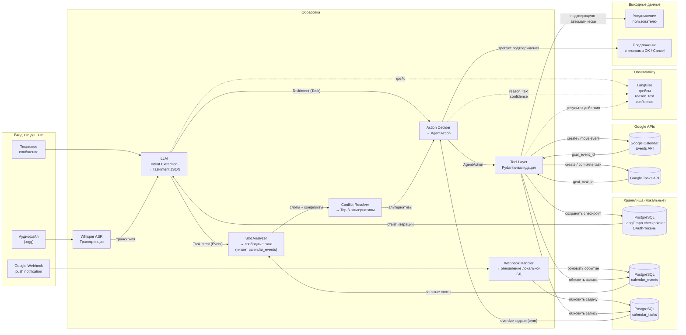

# Диаграмма 5 — Data Flow Diagram

## Цель

Показывает **как данные проходят через систему**: что является входом, как трансформируется,
что сохраняется, что логируется и какие данные возвращаются пользователю.

## Обязательные элементы

- Входные данные: текст / аудио от пользователя
- Трансформации: транскрипция, извлечение намерений, анализ слотов
- Хранилища: PostgreSQL (стейт + calendar_events + calendar_tasks + токены), Google APIs
- Webhook: входящий поток от Google для синхронизации локальной БД
- Логирование: Langfuse (трейсы, reason_text, confidence)
- Выходные данные: ответ / предложение пользователю

## Ключевые трансформации данных

| Вход | Трансформация | Выход |
|---|---|---|
| Аудиофайл (.ogg) | Whisper ASR | Текстовый транскрипт |
| Текст пользователя | LLM Intent Extraction | TaskIntent (JSON) |
| TaskIntent (Event) + calendar_events (БД) | Slot Analysis | Список свободных слотов |
| Свободные слоты | Conflict Resolution | Top-3 альтернативы с score |
| AgentAction | Tool Execution | Запись в Events API или Tasks API |
| Google push notification | Webhook Handler | Обновление calendar_events / calendar_tasks в БД |

## Диаграмма

