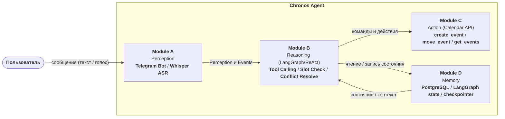

# System Design — Chronos Agent (PoC)

## Обзор системы

Chronos Agent — проактивный AI-планировщик, который принимает голосовые и текстовые запросы через Telegram, извлекает структурированную информацию о задачах и событиях и автономно управляет Google Calendar. В отличие от пассивных инструментов, агент сам инициирует переносы, отслеживает незавершённые задачи и разрешает конфликты расписания.

Система построена на **LangGraph** (управление состоянием + ReAct-цикл). Каждое входное событие запускает итерацию: observe → reason → act → observe. Цикл завершается, когда задача запланирована или пользователю отправлено предложение.

---

## Содержание

- [Ключевые архитектурные решения](#ключевые-архитектурные-решения)
- [Модули и их ответственность](#модули-и-их-ответственность)
- [Workflow выполнения задачи](#workflow-выполнения-задачи)
- [State / Memory / Context](#state--memory--context)
- [Обмен данными между компонентами](#обмен-данными-между-компонентами)
- [Tool / API интеграции](#tool--api-интеграции)
- [Failure Modes, Fallback, Guardrails](#failure-modes-fallback-guardrails)
- [Context Architecture](#context-architecture)
- [Sync Strategy](#sync-strategy)
- [State Management](#state-management)
- [Trade-offs (PoC)](#trade-offs-poc)
- [Ограничения (SLO)](#ограничения-slo)

---

## Ключевые архитектурные решения

| Решение | Обоснование |
|---|---|
| LangGraph как orchestrator | Явный граф состояний вместо монолитного промпта; поддержка персистентного стейта через checkpointer (сохранение состояния агента и контекста задач для продолжения работы после перезапуска или сбоя) |
| ReAct (Reasoning + Acting) через function calling | LLM итеративно рассуждает и вызывает инструменты; не требует промежуточного шага извлечения Intent |
| Локальный Whisper | Нет платы за ASR; данные не покидают сервер |
| Human-in-the-loop для всех side-effect действий | Любое изменение (create, move, complete) требует явного `✅` в Telegram от пользователя |
| Langfuse для observability | Логирование всех LLM-вызовов, tool calls, latency через generations и spans |

---

## Модули и их ответственность



| Модуль | Компоненты | Ответственность |
|---|---|---|
| **A — Perception** | Telegram Bot, Whisper (local) | Приём текста/аудио; транскрипция аудиофайла → текст; нормализация входа |
| **B — Reasoning** | LLM (Mistral), LangGraph | ReAct-цикл; итеративный вызов инструментов; проверка слотов через `find_free_slots`; разрешение конфликтов |
| **C — Action** | Google Calendar API, Telegram Bot | Выполнение calendar-операций; отправка подтверждений и предложений пользователю |
| **D — Memory** | PostgreSQL (стандартный checkpointer) | Персистентный стейт LangGraph; `calendar_events` + `calendar_tasks` (локальная копия); OAuth-токены (зашифрованы) |

---

## Workflow выполнения задачи

### Триггеры запуска агента

```
User message ──────────────────────────────┐
Calendar conflict ──────────────────────── ▶ LangGraph Entry
Cron (hourly check) ───────────────────────┘
```

### Основной flow (happy path)

```
[Telegram] text / voice
       │
       ▼
[Whisper] (если аудио) → транскрипт
       │
       ▼
[AgentCore.run()] → LangGraph ReAct StateGraph
       │
       ▼
[reasoner] — Mistral + REACT_TOOL_DEFINITIONS → tool_call или final_answer
       │
       ├─ final_answer → respond → Telegram → STOP
       │
       └─ tool_call → tool_router
              │
              ├─ READ_ONLY (get_calendar_events, find_free_slots,
              │   get_pending_tasks, get_conversation_history)
              │   → read_tool_executor → result → reasoner (loop)
              │
              ├─ SIDE_EFFECT (create_event, create_task, move_event, complete_task)
              │   → отправить inline keyboard ✅/❌ → [interrupt] hitl_wait
              │       ├─ ✅ → write_tool_executor → respond → STOP
              │       └─ ❌ → respond (шаблон отмены) → STOP
              │
              └─ ask_user → respond → Telegram → STOP
```

### Проактивный flow (hourly cron)

```
[Cron] каждый час
  → get_overdue_tasks() из calendar_tasks (локальная БД)
    (status = needsAction И due_date < now())
  → для каждой просроченной задачи:
       найти свободный слот (next 24h) в calendar_events
       → предложить перенос/выполнение пользователю в Telegram
```

### Webhook flow (фоновый, Google → агент)

```
[Google Calendar Events API / Tasks API]
  → push notification → POST /webhook/google
  → Webhook Handler обновляет calendar_events или calendar_tasks в локальной БД
  → (агент не запускается; только синхронизация данных)
```

---

## State / Memory / Context

| Слой | Хранилище | Содержимое | TTL |
|---|---|---|---|
| **Session state** | LangGraph (in-memory) | Текущий шаг графа, pending confirmation | до конца сессии |
| **Persistent state** | PostgreSQL (checkpointer) | Стейт LangGraph между запусками | 90 дней |
| **calendar_events** | PostgreSQL | Локальная копия событий Google Calendar Events | 90 дней |
| **calendar_tasks** | PostgreSQL | Локальная копия задач Google Tasks (status: needsAction/completed) | 90 дней |
| **OAuth tokens** | PostgreSQL (encrypted) | Google refresh token | до отзыва |
| **service_logs** | PostgreSQL | ERROR/CRITICAL app-события (поиск без доступа к файлам хоста) | 90 дней |
| **Audio files** | Локальный диск | Входящие аудиофайлы | 14 дней |
| **App logs (full)** | Docker json-file (диск хоста) | Все уровни, JSON, ротация 5 × 100 МБ | ~500 МБ rolling |
Контекст агента на каждом шаге содержит: `user_id`, `timezone`, `current_tasks[]`, `calendar_window`, `conversation_history` (последние 5 сообщений).

---

## Обмен данными между компонентами

Данные между модулями передаются через `ReactAgentState` — единственный объект состояния LangGraph-графа. Ключевые поля: `messages` (история function calling текущего хода), `prior_messages` (последние 30 сообщений предыдущих ходов), `pending_tool_call` (текущий вызов инструмента), `final_answer`, `awaiting_confirmation`, `confirmed`.

Инструменты возвращают результат через `tool` role message в `messages`. Примеры:
- `get_calendar_events` → список событий `[{id, title, start, end}]`
- `find_free_slots` → список свободных слотов с `score`
- `create_event` / `create_task` / `move_event` / `complete_task` → `{"success": true, ...}`

---

## Tool / API интеграции

| Инструмент | Операции | Ограничения |
|---|---|---|
| **Google Calendar Events API** | `get_events`, `create_event`, `move_event` | 100 req/min; только primary-календарь |
| **Google Tasks API** | `get_tasks`, `create_task`, `complete_task` | 50 req/s (квота Google Tasks) |
| **Google Calendar Webhook** | push notification → `POST /webhook/google` | TTL канала до 7 дней; продление раз в 6 дней |
| **Telegram Bot API** | `send_message`, `send_inline_keyboard` | — |
| **Whisper (local)** | `transcribe(audio)` | Файлы до 20 МБ; поддерживает `.ogg` |
| **Langfuse** | `log_trace`, `log_span` | Только observability, не влияет на flow |

`delete_event` / `delete_task` — намеренно не реализованы в PoC. Доступны только через прямой Google Calendar/Tasks UI.

---

## Failure Modes, Fallback, Guardrails

| Сценарий | Детекция | Поведение |
|---|---|---|
| **Недостаточно данных** | LLM решает вызвать `ask_user` | Задать уточняющий вопрос; не создавать событий |
| **Конфликт в календаре** | Агент вызывает `get_calendar_events` или `find_free_slots` | LLM предлагает альтернативное время через `ask_user` или `find_free_slots` |
| **LLM API 429 / 5xx** | HTTP status code | Exponential backoff (1 s, 2 s, 4 s); после 3 попыток → сообщение пользователю |
| **Google OAuth expired** | 401 от Calendar API | Отправить ссылку переавторизации; продолжить после auth |
| **Любое side-effect действие** | `pending_tool_call.name` в SIDE_EFFECT_TOOLS | Обязательное подтверждение `✅ / ❌` в Telegram |
| **Prompt injection** | System prompt ограничивает область + HITL для всех записей | Агент не выполняет действия без явного `✅` |
| **Таймаут подтверждения** | > 5 мин без ответа | Сессия → stale; пользователь может повторить запрос |
| **Невалидный ввод** | Текст > 4000 символов / аудио > 20 МБ | Отклонить с сообщением об ошибке |
| **Превышение итераций** | `iteration_count >= MAX_TOOL_CALLS_PER_ITERATION` | Force stop с сообщением пользователю |

---

## Context Architecture

Агент разделяет входные данные на два класса: **eager** (загружается всегда при старте итерации) и **lazy** (запрашивается только если нужно).

**Eager-контекст** — минимальный набор, без которого нельзя начать reasoning:
- `user_id`, `timezone`
- Текущий запрос пользователя (текст или транскрипт)
- Последние 5 сообщений диалога (sliding window)
- Список задач в статусе `pending` / `overdue` (из PostgreSQL)

**Lazy-контекст** — запрашивается только при необходимости:
- `calendar_events` из локальной БД — только при переходе на Slot Analyzer (только для Event-запросов)
- Детали конкретного события — только при разрешении конфликта

**Принцип:** агент не загружает весь календарь при старте. Слоты читаются из локальной БД или через Google API; окно ограничено ± 24 ч. Для Task-запросов Slot Analyzer не вызывается вовсе.

---

## Sync Strategy

События и задачи Google Calendar **хранятся локально в PostgreSQL** и синхронизируются с Google через Calendar Events push webhook, write-through при прямом создании агентом и fallback-запросы при промахе локальной БД. Регулярного полного polling-sync по расписанию нет: в нормальном режиме актуальность локальной БД поддерживается входящими Google Calendar webhook-уведомлениями и прямыми записями агента. Google Tasks API push-уведомления не поддерживает; задачи догоняются через write-through, fallback и startup recovery. При reasoning агент читает данные из локальной БД, а не из Google API напрямую. Это снижает число внешних вызовов и позволяет cron работать без API-запросов к Google.

Если сервис был выключен или упал, при следующем старте запускается startup recovery. Агент читает `last_alive_at` из `service_heartbeat`, оценивает длительность простоя и, если простой больше `RECOVERY_MIN_DOWNTIME_SECONDS`, догоняет локальную БД: для Calendar Events запрашивает изменения с `updatedMin = last_alive_at`, а для Google Tasks делает полный fetch, потому что Tasks API не поддерживает `updatedMin`. Только после успешной синхронизации всех пользователей `last_alive_at` сдвигается на текущее время.

Помимо синхронизации данных, APScheduler запускает `cron_check`: он регулярно проходит по активным пользователям, читает из локальной БД незавершённые просроченные задачи (`status = needsAction`, `due_at < now`) и отправляет пользователю Telegram-уведомление. Этот путь не ходит в Google Tasks API напрямую, поэтому качество напоминаний зависит от актуальности таблицы `calendar_tasks`.

| Источник | Стратегия | Частота | Компромисс PoC |
|---|---|---|---|
| **Google Calendar Events** | Push webhook → локальная БД | При каждом изменении в Google | Небольшая задержка webhook; зато нет лишних API-вызовов при чтении |
| **Google Tasks** | Write-through / fallback / startup recovery → локальная БД | При изменениях агентом, промахе БД или recovery | Tasks API не поддерживает push-уведомления |
| **Прямое создание агентом** | Write-through | Сразу при создании события/задачи | Запись и в Google API, и в локальную БД одновременно |
| **Startup recovery** | Catch-up sync из Google → локальная БД | При старте после простоя больше `RECOVERY_MIN_DOWNTIME_SECONDS` | Events догоняются по `updatedMin`; Tasks синхронизируются полным fetch |
| **Cron-триггер** | Pull из локальной БД → Telegram-уведомление | Раз в час (`CRON_INTERVAL_MINUTES`) | Максимальная задержка реакции на просроченную задачу — 1 час; задачи без `due_at` не попадают в напоминания |
| **Fallback при пустом результате** | Прямой Google API-запрос | При промахе локальной БД | Актуализирует БД; используется при первом запуске или сбое webhook |

Webhook-канал Google имеет TTL до 7 дней и обновляется APScheduler раз в `WEBHOOK_RENEWAL_INTERVAL_DAYS` дней, по умолчанию раз в 6 дней. При сбое обновления агент переходит в деградированный режим: читает из Google API напрямую через fallback, пока канал не восстановится.

---

## State Management

LangGraph хранит стейт в **PostgreSQL через стандартный `langgraph-checkpoint-postgres`**. Кастомной схемы нет — используется схема из коробки.

**Что хранится в стейте:**
- `messages` — история function calling текущего хода
- `prior_messages` — последние 30 сообщений предыдущих ходов
- `pending_tool_call` — текущий вызов инструмента (name + arguments)
- `iteration_count` — счётчик шагов reasoner
- `final_answer` — финальный ответ агента
- `awaiting_confirmation` / `confirmed` — состояние HITL
- `thread_id` — изолирует сессии разных пользователей

**Что НЕ хранится в стейте (лежит отдельно в БД):**
- История задач пользователя (отдельная таблица)
- OAuth-токены (отдельно, зашифрованы)

**Жизненный цикл стейта:**
- Сессия стартует при получении сообщения или cron-триггере
- Ожидание подтверждения: стейт сохраняется; агент "спит" до ответа пользователя
- Таймаут 5 мин без ответа → сессия помечается `stale`; стейт сохраняется для аудита, но не возобновляется автоматически

---


## Trade-offs (PoC)

| Компромисс | Что выбрано | Что жертвуем | Почему допустимо для PoC |
|---|---|---|---|
| **Актуальность vs сложность** | Локальная БД + webhook sync | Данные могут отставать от Google на время доставки webhook (секунды) | Задержка незначима для PoC; fallback на прямой API при пустой БД |
| **Cost vs качество LLM** | Mistral | Потенциально ниже качество tool selection vs GPT-4 | Достаточно для > 80% NLU Success Rate |
| **Complexity vs гибкость** | Стандартный LangGraph checkpointer | Нет тонкой настройки retention / TTL | Упрощает запуск; кастомизация — после PoC |
| **Memory vs простота** | Только PostgreSQL, без VectorDB | Нет долгосрочных паттернов предпочтений | Паттерны поведения не нужны для базовых сценариев PoC |
| **Autonomy vs safety** | HITL для деструктивных действий | Дополнительный round-trip с пользователем | Для PoC важнее доверие, чем скорость |

---

## Ограничения (SLO)

| Параметр | Целевое значение |
|---|---|
| **End-to-end latency p95** | < 7 сек (от запроса до ответа бота) |
| **NLU Success Rate** | > 80% корректно извлечённых дата/время/тип |
| **Hallucination Rate** | < 10% некорректных/лишних действий |
| **Binary Acceptance** | > 60% предложений подтверждается пользователем |
| **Google Calendar API** | ≤ 100 req/min |
| **LLM бюджет** | $10–20 на период PoC |
| **Аудио retention** | 14 дней |
| **Метаданные задач** | 90 дней (по согласию) |
